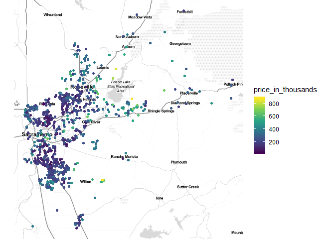

Drawing Maps with R
================

### ggmap

``` r
suppressMessages(library(caret))
suppressMessages(library(dplyr))
suppressMessages(library(ggmap))
data("Sacramento")

## stamen map
scrmnt <- c(left = min(Sacramento$longitude),
            bottom = min(Sacramento$latitude),
            right = max(Sacramento$longitude),
            top = max(Sacramento$latitude))
get_stamenmap(scrmnt, maptype = "watercolor") %>% ggmap() +
  ggtitle("Sacramento City")
```


<!-- -->

``` r
Sacramento$price_in_thousands <- round(Sacramento$price / 1000)
qmplot(longitude, latitude, data = Sacramento,
       maptype = "toner-lite",
       color = price_in_thousands) + scale_color_viridis_c()
```


<!-- -->

``` r
## GOOGLE map
register_google("your_google_api_key")

sacramento_map <-
  get_googlemap(
    center = c(
      lon = mean(Sacramento$longitude),
      lat = mean(Sacramento$latitude)
    ),
    zoom = 10,
    maptype = "satellite"
  ) %>%
  ggmap(extent = "device")
```


``` r
sacramento_map + geom_point(
  aes(x = longitude, y = latitude,
      color = price_in_thousands),
  data = Sacramento,
  alpha = 0.5,
  size = 2
) +
  scale_color_viridis_c() + 
  ggtitle("House Prices in Sacramento") +
  theme(legend.position = "top",
        legend.direction = "horizontal")
```

<!-- -->

``` r
dev.off()
```


``` r
## To convert a df to sf
# sacramento <- st_as_sf(Sacramento, coords = c("longitude", "latitude"),
#                        crs = "+proj=longlat +datum=WGS84 +no_defs")
#sacramento <- st_cast(sacramento, "MULTIPOINT")
```

## tmap

``` r
suppressMessages(library(eurostat))
tgs00026 <- get_eurostat("tgs00026", time_format = "raw")
```

    ## Table tgs00026 cached at C:\Users\noor\AppData\Local\Temp\Rtmpk5pbY7/eurostat/tgs00026_raw_code_TF.rds

``` r
head(tgs00026)
```

    ## # A tibble: 6 x 6
    ##   unit    direct na_item geo   time  values
    ##   <fct>   <fct>  <fct>   <fct> <chr>  <dbl>
    ## 1 PPS_HAB BAL    B6N     AT11  2006   19000
    ## 2 PPS_HAB BAL    B6N     AT12  2006   19800
    ## 3 PPS_HAB BAL    B6N     AT13  2006   20000
    ## 4 PPS_HAB BAL    B6N     AT21  2006   18500
    ## 5 PPS_HAB BAL    B6N     AT22  2006   18600
    ## 6 PPS_HAB BAL    B6N     AT31  2006   19300

``` r
tgs00026$country <- substr(as.character(tgs00026$geo), 1, 2)
## getting geometry
eurostat_geodata <- suppressMessages(get_eurostat_geospatial()[, 7:8])
```

``` r
## Household income in 2016
tgs_rom <-tgs00026[tgs00026$time == "2016",]
## merging with geometry
tgs_map <- merge(x = eurostat_geodata, y = tgs_rom, by = "geo")
## interactive view mode
tmap_mode("view")
tm_shape(tgs_map) + tm_polygons(col = "values",
                                palette = "YlGnBu",
                                title = "Household Income",
                                style = "quantile") 
```


``` r
## Household change rate in Italy 2006 - 2016
tgs00026_06_it <- tgs00026[tgs00026$time == "2006" &
                             tgs00026$country == "IT",]
tgs00026_16_it <- tgs00026[tgs00026$time == "2016" &
                             tgs00026$country == "IT",]
tgs00026_16_it$delta <-
  100 * (tgs00026_16_it$values - tgs00026_06_it$values) /
  tgs00026_06_it$values

suppressMessages(library(tmap))
tmap_mode("plot")
```

    ## tmap mode set to plotting

``` r
tgs_it_map <- merge(x = eurostat_geodata, y = tgs00026_16_it, by = "geo")
tm_shape(tgs_it_map) +
  tm_fill(
    col = "delta",
    palette = "RdBu",
    title = "Household\nChange (%)",
    style = "quantile"
  ) +
  tm_borders(alpha = 0.6)
```


<!-- -->

### Geospatial Storytelling with tmap R

``` r
data("World", "metro", package = "tmap")
metro$gr <- 100 * ((metro$pop2020 - metro$pop2010) / metro$pop2010)
tm_shape(World) + tm_polygons(col = "income_grp",
                              palett = "-Blues",
                              title = "Income") +
  tm_text(text = "iso_a3", size = "AREA") +
  tm_shape(metro) +
  tm_bubbles(
    size = "pop2020",
    title.size = "Est. Metropolitan Population \nin 2020",
    col = "gr",
    title.col = "2010-2020 Population \nGrowth (%)",
    palette = "-RdYlBu",
    border.col = "black",
    border.alpha = 0.5,
    style = "quantile"
  )
```


